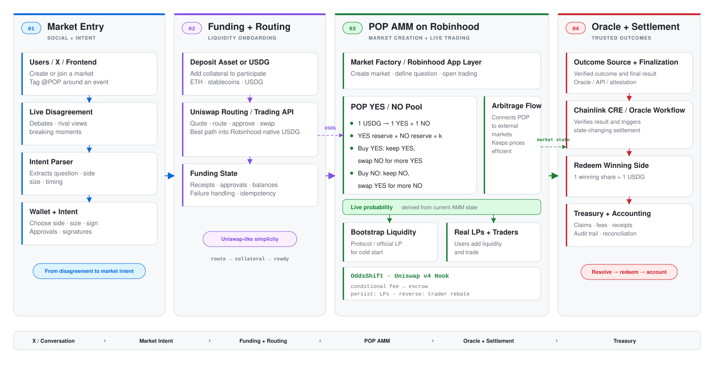

# POP

> **An AMM-native prediction market for Robinhood Chain, denominated in USDG.**

POP brings Uniswap-style continuous liquidity to prediction markets.

Instead of relying on an order book and dedicated market makers, POP lets users trade **YES / NO outcomes against onchain AMM liquidity**, turning market prices into continuously updating probabilities.

**Live Demo:** https://populab.xyz/robinhood

For **Arbitrum Open House Singapore 2026**, POP is deployed on **Robinhood Chain Testnet** with **USDG** as its collateral and settlement asset, together with **OddsShift**, a conditional fee-rebate mechanism designed to protect passive liquidity during information shocks.

---

## Architecture



---

## Robinhood Chain Deployment

POP is deployed on **Robinhood Chain Testnet (Chain ID 46630)** and uses **USDG** as the market collateral and settlement asset.

| Component | Address |
| --- | --- |
| **POP EventMarketV2** | [`0x5c70D71Bc29b883c0F10DEC5E8Aacd3F17B99a61`](https://explorer.testnet.chain.robinhood.com/address/0x5c70D71Bc29b883c0F10DEC5E8Aacd3F17B99a61) |
| **USDG** | [`0x7E955252E15c84f5768B83c41a71F9eba181802F`](https://explorer.testnet.chain.robinhood.com/address/0x7E955252E15c84f5768B83c41a71F9eba181802F) |

### Where Robinhood + USDG are used

- [`DeployRobinhoodEventMarketV2.s.sol`](./contracts/script/DeployRobinhoodEventMarketV2.s.sol) — deploys `EventMarketV2` to Robinhood Chain using `USDG_ADDRESS` as collateral.
- [`RobinhoodDeploymentPreflight.sol`](./contracts/src/deployment/RobinhoodDeploymentPreflight.sol) — validates Robinhood Testnet chain ID, USDG address, symbol and decimals before deployment.
- [`EventMarketV2.sol`](./contracts/src/EventMarketV2.sol) — AMM trading, liquidity, fee accounting, OddsShift and settlement using the configured collateral token.
- [`robinhood.ts`](./webapp/src/config/robinhood.ts) — frontend chain configuration, RPC, explorer, USDG and live market contract.
- [`robinhood-config.test.ts`](./webapp/test/robinhood-config.test.ts) — tests the Robinhood deployment configuration.

---

## Why POP

Prediction markets are markets for information, but most liquidity still depends on active market makers and order books.

When new information arrives, odds can move quickly. Order-book liquidity may widen or disappear, while passive AMM liquidity can remain exposed to stale prices.

POP uses an AMM instead:

```text
USDG
  ↓
YES / NO AMM
  ↓
continuous trading
  ↓
live market probability
  ↓
resolution
  ↓
USDG settlement
```

Users can trade continuously, enter or exit before resolution, provide liquidity, and redeem winning positions onchain.

A YES price of `0.63 USDG` represents roughly **63% implied probability**.

---

## OddsShift

Prediction markets are especially vulnerable to **information shocks**: moments when new information rapidly reprices the market.

**OddsShift** is a conditional fee-rebate mechanism designed for these moments.

Every trade provisionally pays:

```text
Base LP fee          0.30%
Protection fee       0.70%
                     -----
Total                1.00%
```

If the move persists, the protection fee is retained for LPs.

If the move reverses, the 0.70% protection fee is rebated to the trader.

```text
persistent move  → LP protection
reverted move    → trader rebate
```

Classification happens **ex post from subsequent market behavior**, without relying on a news oracle or external price feed.

More details: [`oddsshift.md`](./oddsshift.md)

---

## How It Works

1. **Create** — launch a binary YES / NO market.
2. **Bootstrap** — seed the market with USDG liquidity.
3. **Trade** — buy or sell outcomes against the AMM.
4. **Discover** — prices continuously express implied probability.
5. **Protect** — OddsShift evaluates rapid repricing.
6. **Resolve** — settle the final outcome onchain.
7. **Redeem** — winning positions redeem into USDG.

---

## Built During Open House

- Robinhood Chain deployment flow
- USDG-denominated collateral and settlement
- AMM-based YES / NO trading
- liquidity management
- OddsShift fee escrow and rebate logic
- Robinhood-focused frontend
- Foundry tests and release validation
- focused Slither security analysis

---

## Tech Stack

**Contracts:** Solidity `0.8.24`, Foundry, OpenZeppelin  
**Frontend:** React, TypeScript, Wagmi, Viem  
**Backend:** Node.js, TypeScript, Express, Prisma, PostgreSQL  
**Network:** Robinhood Chain Testnet  
**Settlement asset:** USDG

---

## Run Locally

### Contracts

```bash
cd contracts
forge build
forge test
```

### Frontend

```bash
cd webapp
pnpm install
pnpm run dev
```

### Release Validation

```bash
./scripts/validate-release.sh
```

---

## Vision

Prediction markets compress disagreement into a price.

POP combines **stablecoin liquidity, AMM price discovery, and programmable market microstructure** to make prediction markets continuously tradable onchain.

**Robinhood Chain** provides the execution layer.  
**USDG** provides the settlement asset.  
**POP** provides the market.  
**OddsShift** protects liquidity when information matters most.
